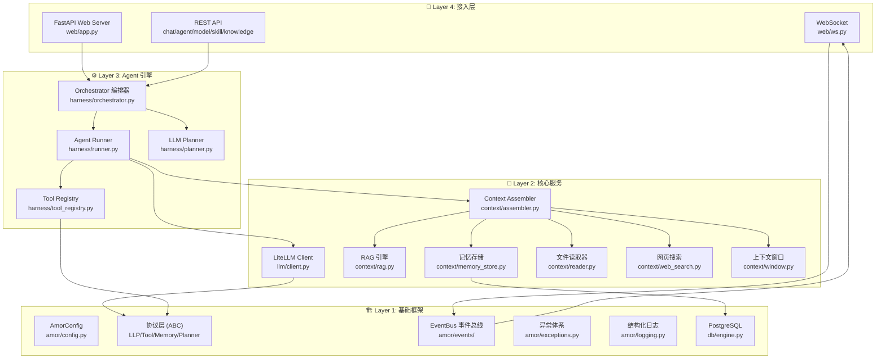
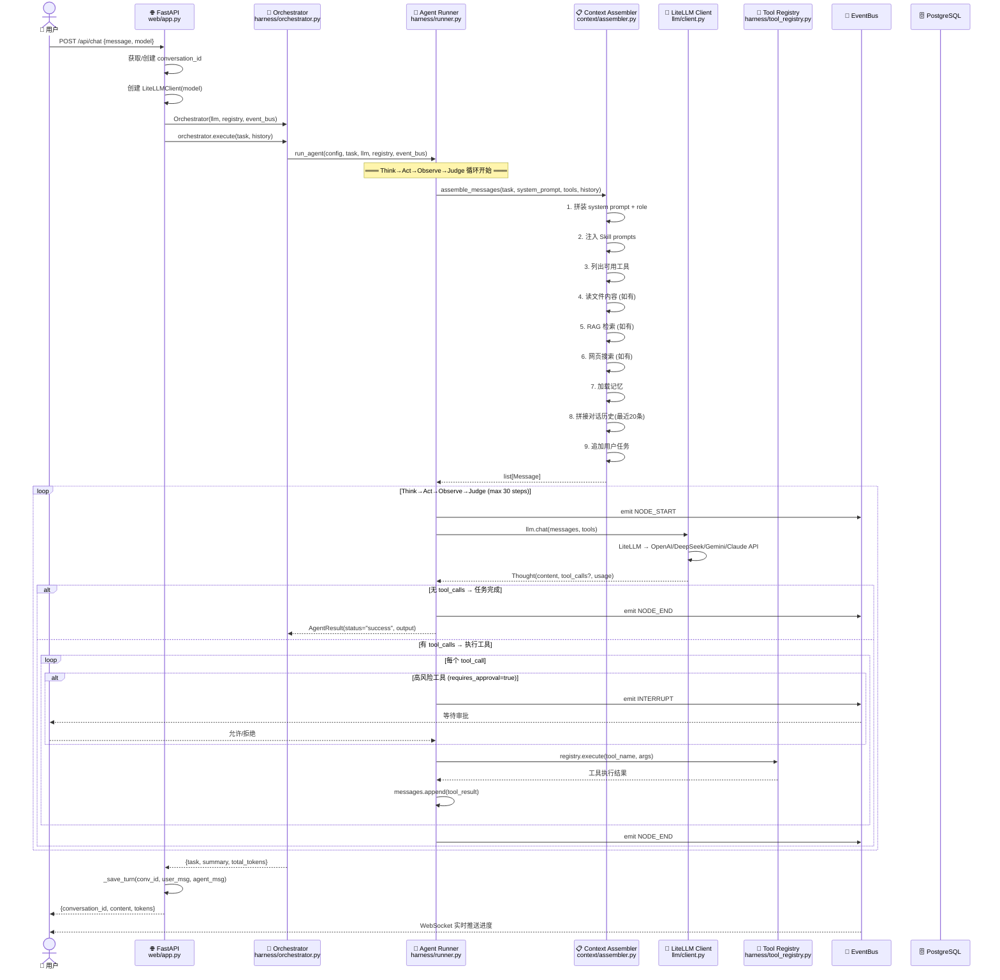
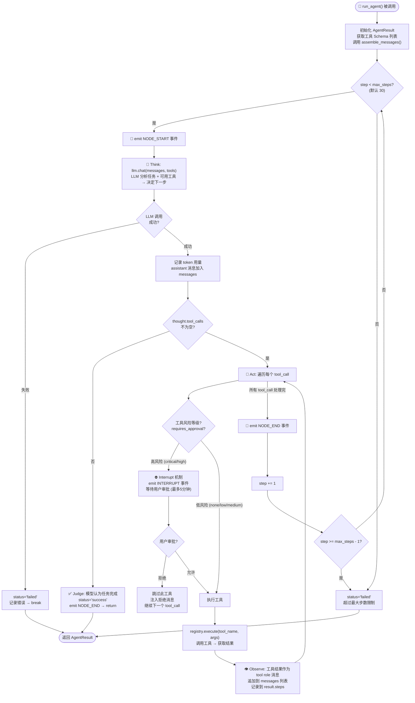
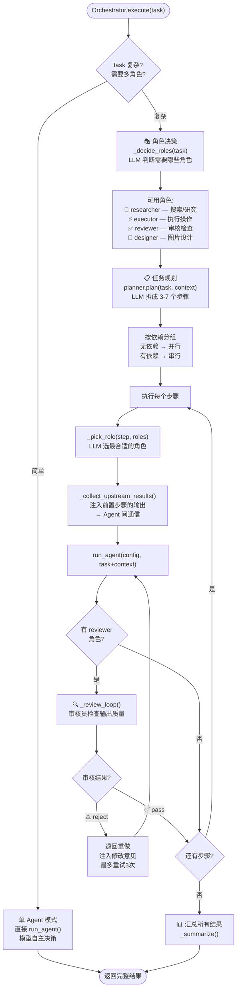
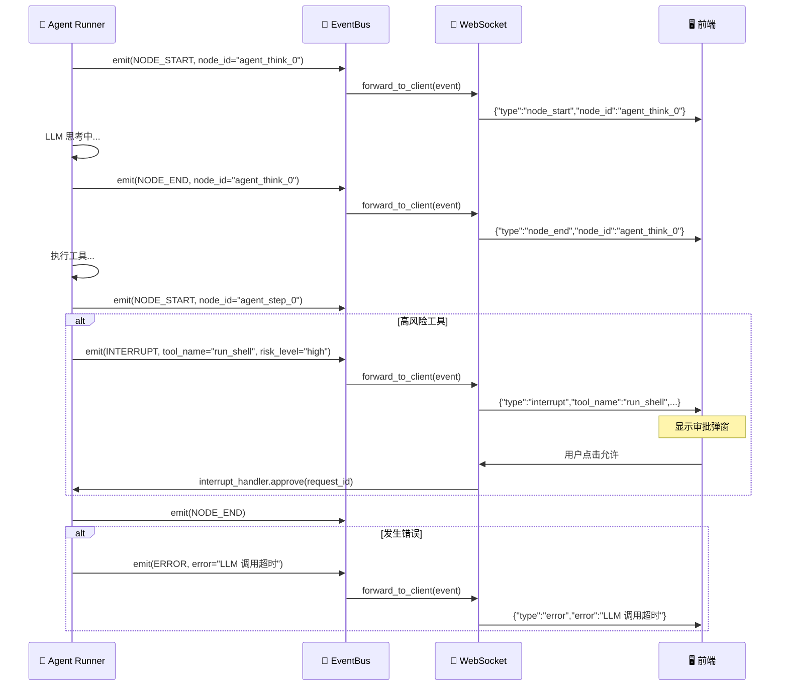
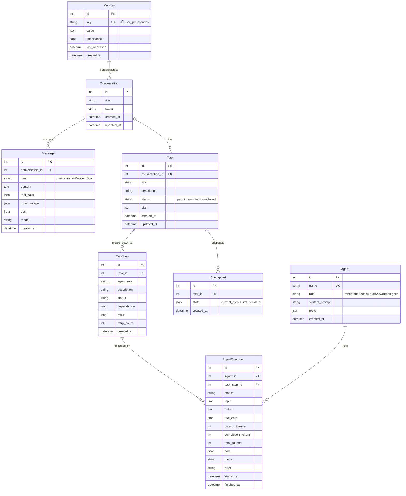
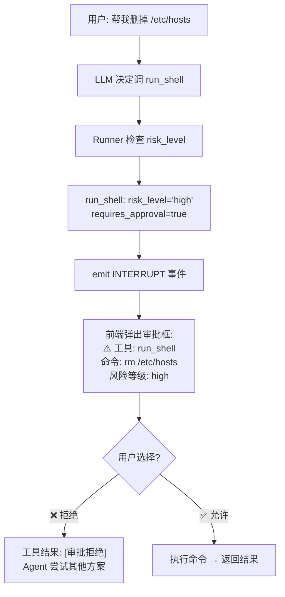

# Amor Agent 架构流程图

> 四层 AI Agent 系统完整流程解析

---

## 目录

1. [系统总览 — 四层架构](#1-系统总览--四层架构)
2. [请求完整生命周期](#2-请求完整生命周期)
3. [核心循环: Think → Act → Observe → Judge](#3-核心循环-think--act--observe--judge)
4. [上下文组装流程](#4-上下文组装流程)
5. [多 Agent 编排流程](#5-多-agent-编排流程)
6. [工具系统](#6-工具系统)
7. [事件系统 & WebSocket 实时推送](#7-事件系统--websocket-实时推送)
8. [数据库 ER 图](#8-数据库-er-图)
9. [完整实例演练](#9-完整实例演练)

---

## 1. 系统总览 — 四层架构



**层次关系:**
- **Layer 1 (基础框架):** 所有模块的基石 — 配置、协议、事件、异常、日志、数据库
- **Layer 2 (核心服务):** LLM 调用、上下文组装、RAG、记忆、文件解析
- **Layer 3 (Agent 引擎):** Agent 运行循环、多 Agent 编排、任务规划、工具注册
- **Layer 4 (接入层):** HTTP API、WebSocket、前端静态文件

---

## 2. 请求完整生命周期



---

## 3. 核心循环: Think → Act → Observe → Judge

这是整个系统的心脏 —— 单个 Agent 的执行循环。



**关键设计决策:**
- **不写死策略**: 模型自己判断是直接回答还是调工具，不强制 ReAct/PlanExecute 模式
- **工具+对话混合**: 每次 Think 都带完整工具列表，模型自主决策
- **中断机制**: 高危操作 (如 `run_shell`) 发射 INTERRUPT 事件，等人点"允许"

---

## 4. 上下文组装流程

```mermaid
flowchart TD
    START(["assemble_messages() 被调用"]) --> SYS["1️⃣ 构建系统消息<br/>system_prompt + role_prompt"]

    SYS --> SKILL{"有 Skill<br/>Prompt 注入?"}
    SKILL -->|是| SKILL_INJ["注入 Skill 行为规则<br/>get_system_prompt_extensions()"]
    SKILL -->|否| TOOLS

    SKILL_INJ --> TOOLS{"有工具<br/>Schema?"}
    TOOLS -->|是| TOOLS_INJ["追加工具列表<br/>每个工具的 name + description"]
    TOOLS -->|否| FILES

    TOOLS_INJ --> FILES{"有文件<br/>路径?"}

    FILES -->|是| READ_FILES["📄 读取文件内容<br/>read_file() 按类型路由解析器"]
    READ_FILES --> FILES_DETAIL["PDF/DOCX → LlamaParse<br/>XLSX/CSV → pandas → HTML表格<br/>PNG/JPG → GPT-4o Vision<br/>PPTX/HTML → MarkItDown<br/>MD/TXT → 直接读"]

    FILES -->|否| RAG_CHECK

    FILES_DETAIL --> RAG_CHECK{"有 RAG<br/>查询?"}

    RAG_CHECK -->|是| RAG_DO["🔍 RAG 检索<br/>BGE embedding → ChromaDB 向量检索<br/>返回 top_k 最相关片段"]

    RAG_CHECK -->|否| SEARCH_CHECK
    RAG_DO --> SEARCH_CHECK{"有网页<br/>搜索?"}

    SEARCH_CHECK -->|是| SEARCH_DO["🌐 Tavily Search API<br/>返回标题+URL+摘要"]
    SEARCH_CHECK -->|否| MEM_CHECK

    SEARCH_DO --> MEM_CHECK{"有记忆<br/>存储?"}

    MEM_CHECK -->|是| MEM_LOAD["🧠 加载记忆<br/>PostgresMemory.query()<br/>如: user_preferences"]
    MEM_CHECK -->|否| HIST_CHECK

    MEM_LOAD --> HIST_CHECK{"有对话<br/>历史?"}

    HIST_CHECK -->|是| HIST_TRIM["✂️ 裁剪历史<br/>window.trim_messages()<br/>保留最近20条 + system prompt"]
    HIST_CHECK -->|否| TASK

    HIST_TRIM --> TASK["9️⃣ 追加用户任务<br/>Message(role='user', content=task)"]

    TASK --> RETURN(["返回 list[Message] — 完整的 LLM 输入"])
```



---

## 5. 多 Agent 编排流程



**Agent 间通信机制:**
```
Step 1 (researcher): "搜索 Python 异步编程最佳实践"
  → 输出: "asyncio 核心概念: event loop, coroutine, task..."

Step 2 (executor, depends_on=[1]):
  → 上下文自动注入:
    "## 前置步骤的输出（供参考）
     ### [1] researcher 的输出
     asyncio 核心概念: event loop, coroutine, task..."
  → 基于研究结果执行操作
```

---

## 6. 工具系统

```mermaid
flowchart LR
    subgraph SOURCE["📦 工具来源"]
        BUILTIN["内置工具<br/>harness/skills/builtin/"]
        USER["用户工具<br/>harness/skills/user/"]
        MCP["MCP Server<br/>外部工具"]
    end

    subgraph REGISTRY["🔧 ToolRegistry"]
        REG["_tools: dict[name, ToolProtocol]"]
    end

    subgraph TOOLS["🛠️ 内置工具清单"]
        T1["read_file — 读取文件"]
        T2["write_file — 写入文件"]
        T3["list_files — 列出目录"]
        T4["run_shell — 执行命令"]
        T5["web_search — 网页搜索"]
        T6["rag_query — 知识库检索"]
        T7["generate_image — AI 生图"]
        T8["grep — 内容搜索"]
        T9["edit_file — 精准编辑"]
        T10["get_time — 获取时间"]
        T11["glob — 文件匹配"]
        T12["webfetch — 抓取网页"]
    end

    BUILTIN --> REG
    USER --> REG
    MCP -->|"_MCPToolWrapper"| REG
    REG --> TOOLS

    subgraph SCHEMA["📋 ToolSchema"]
        NAME["name: 工具名"]
        DESC["description: 用途描述"]
        PARAMS["parameters: JSON Schema"]
        RISK["risk_level: none|low|medium|high|critical"]
        APPROVAL["requires_approval: bool"]
    end

    REG --> SCHEMA
```



**工具风险等级与审批:**

| 风险等级 | 含义 | 是否需要审批 | 示例 |
|---------|------|------------|------|
| `none` | 只读操作 | ❌ | `read_file`, `grep`, `get_time` |
| `low` | 低风险读操作 | ❌ | `web_search`, `rag_query` |
| `medium` | 可能修改文件 | ❌/✅ | `write_file`, `edit_file` |
| `high` | 执行外部命令 | ✅ | `run_shell` |
| `critical` | 不可逆操作 | ✅ | `rm -rf`, `DROP TABLE` |

---

## 7. 事件系统 & WebSocket 实时推送



**7 种标准事件类型:**

| 事件 | 触发时机 | 携带数据 |
|------|---------|---------|
| `NODE_START` | 节点开始执行 | node_id |
| `NODE_END` | 节点执行结束 | node_id |
| `EDGE_TRAVERSE` | 步骤间跳转 | node_id, state |
| `ERROR` | 发生错误 | node_id, error |
| `STREAM_TOKEN` | 流式输出 token | token 内容 |
| `INTERRUPT` | 高危操作暂停 | tool_name, tool_arguments, risk_level |
| `USER_RESPONSE` | 用户审批响应 | 允许/拒绝 |

---

## 8. 数据库 ER 图



---

## 9. 完整实例演练

### 场景: 用户问 "帮我分析 docs/ 目录下的 design.md，然后搜一下最新的 Python 3.13 异步特性，最后写一份对比报告"

下面逐步追踪整个流程:

```
═══════════════════════════════════════════════════════════════════
STEP 1: 用户请求到达
═══════════════════════════════════════════════════════════════════

POST /api/chat
{
  "message": "帮我分析 docs/ 目录下的 design.md，然后搜一下最新的
              Python 3.13 异步特性，最后写一份对比报告",
  "model": "deepseek/deepseek-v4-pro"
}

↓ web/routes/chat.py

conversation_id = 1 (新建)
history = []  (首次对话)
llm = LiteLLMClient(model="deepseek/deepseek-v4-pro")
orchestrator = Orchestrator(llm, registry)

═══════════════════════════════════════════════════════════════════
STEP 2: Orchestrator 分析任务
═══════════════════════════════════════════════════════════════════

orchestrator.execute(task) → 单 Agent 模式 (仿 Claude Code)

↓ harness/runner.py

AgentConfig(
    name="agent",
    system_prompt="你是一个 AI Agent。回答简洁直接...",
    model="deepseek/deepseek-v4-pro",
    max_steps=30
)

═══════════════════════════════════════════════════════════════════
STEP 3: 上下文组装
═══════════════════════════════════════════════════════════════════

assemble_messages(task, system_prompt, tool_schemas, history)

组装结果 (发给 LLM 的完整 messages):

[
  {
    role: "system",
    content: """
      你是一个 AI Agent。回答简洁直接，不要啰嗦。
      只有需要实时信息或执行操作时才调工具。

      ## 可用工具
      - read_file: 读取文件内容
      - write_file: 写入内容到文件
      - web_search: 搜索互联网获取最新信息
      - run_shell: 执行 Shell 命令并返回输出
      - grep: 在文件中搜索匹配的文本模式
      ... (共12个工具)
    """
  },
  {
    role: "user",
    content: "帮我分析 docs/ 目录下的 design.md，然后搜一下最新的
              Python 3.13 异步特性，最后写一份对比报告"
  }
]

═══════════════════════════════════════════════════════════════════
STEP 4: Think→Act→Observe→Judge 循环
═══════════════════════════════════════════════════════════════════

--- Round 1 ---

🧠 Think: llm.chat(messages, tools)
   → LLM 决定: "需要先读文件，再搜索"
   → Thought(
       content="我先读取 design.md 文件",
       tool_calls=[
         ToolCall(id="call_1", name="read_file",
                  arguments={"path": "docs/design.md"})
       ]
     )

🔧 Act: registry.execute("read_file", {"path": "docs/design.md"})
   → context/reader.py → 路由到 "plain" 解析器
   → 直接读取文本内容
   → 返回: "## Amor Agent 设计文档\n\n### 架构概述\n..."

👁️ Observe: 工具结果作为 tool 消息追加到 messages
   messages.append({
     role: "tool",
     content: "## Amor Agent 设计文档\n\n### 架构概述\n...",
     tool_call_id: "call_1"
   })

--- Round 2 ---

🧠 Think: llm.chat(messages, tools)
   → LLM 分析文件后决定搜索
   → Thought(
       content="文件已读完，现在搜索 Python 3.13 异步特性",
       tool_calls=[
         ToolCall(id="call_2", name="web_search",
                  arguments={"query": "Python 3.13 异步 asyncio 新特性"})
       ]
     )

🔧 Act: registry.execute("web_search", {"query": "Python 3.13..."})
   → context/web_search.py → Tavily API
   → 返回:
     """
     ### Python 3.13 新特性: 异步相关
     - asyncio.TaskGroup 改进
     - 事件循环性能提升 15%
     ...
     """

👁️ Observe: messages 追加搜索结果

--- Round 3 ---

🧠 Think: llm.chat(messages, tools)
   → LLM 判断: 信息已齐，可以写报告了
   → Thought(
       content="现在将分析结果写入对比报告",
       tool_calls=[
         ToolCall(id="call_3", name="write_file",
                  arguments={
                    "path": "comparison_report.md",
                    "content": "# Amor Agent vs Python 3.13 异步特性对比\n\n..."
                  })
       ]
     )

🔧 Act: registry.execute("write_file", {...})
   → 文件写入成功

--- Round 4 ---

🧠 Think: llm.chat(messages, tools)
   → Thought(
       content="✅ 完成！已读取 design.md，搜索 Python 3.13 异步特性，
                并生成对比报告 comparison_report.md。"
       tool_calls=null  ← 无工具调用！
     )

✅ Judge: thought.tool_calls 为空 → 任务完成
   → AgentResult(
       status="success",
       output="✅ 完成！已读取 design.md...",
       total_tokens=2847
     )

═══════════════════════════════════════════════════════════════════
STEP 5: 结果返回
═══════════════════════════════════════════════════════════════════

orchestrator.execute() 返回:
{
  "task": "帮我分析 docs/ 目录下的 design.md...",
  "mode": "auto",
  "summary": "✅ 完成！已读取 design.md，搜索 Python 3.13 异步特性...",
  "total_tokens": 2847
}

↓ web/routes/chat.py

_save_turn(conv_id=1, user_msg, agent_msg)
→ 内存存储 (生产环境换 PostgreSQL)

HTTP Response:
{
  "conversation_id": 1,
  "content": "✅ 完成！...",
  "mode": "auto",
  "tokens": 2847
}

═══════════════════════════════════════════════════════════════════
实时推送 (WebSocket 并行)
═══════════════════════════════════════════════════════════════════

WebSocket → 前端:
  {"type":"node_start","node_id":"agent_think_0"}
  {"type":"node_end","node_id":"agent_think_0"}
  {"type":"node_start","node_id":"agent_step_0"}
  {"type":"node_end","node_id":"agent_step_0"}
  {"type":"node_start","node_id":"agent_think_1"}
  {"type":"node_end","node_id":"agent_think_1"}
  ...
  {"type":"node_end","node_id":"agent_done"}
```

### 如果用户消息是 "帮我删掉 /etc/hosts"，会发生什么？



---

## 文件索引

| 文件 | 行数 | 职责 |
|------|------|------|
| `amor/config.py` | 47 | Pydantic 配置系统，环境变量读取 |
| `amor/exceptions.py` | 102 | 7 种异常类型的分层体系 |
| `amor/logging.py` | 55 | 结构化日志 + 格式化器 |
| `amor/protocols/llm.py` | 56 | LLM 协议 (Message, Thought, ToolCall) |
| `amor/protocols/memory.py` | 45 | 记忆协议 (MemoryEntry) |
| `amor/protocols/planner.py` | 54 | 规划器协议 (Plan, PlanStep) |
| `amor/protocols/tool.py` | 48 | 工具协议 (ToolSchema, RiskLevel) |
| `amor/events/bus.py` | 37 | 发布/订阅事件总线 |
| `amor/events/types.py` | 40 | 7 种事件类型定义 |
| `llm/client.py` | 117 | LiteLLM 统一接口适配 |
| `context/assembler.py` | 93 | 上下文 9 层组装 |
| `context/reader.py` | 164 | 多格式文件解析器路由器 |
| `context/rag.py` | 87 | ChromaDB + BGE 向量检索 |
| `context/memory_store.py` | 55 | PostgreSQL 持久记忆 |
| `context/window.py` | 43 | Token 估算 + 上下文裁剪 |
| `context/web_search.py` | 18 | Tavily 搜索封装 |
| `harness/runner.py` | 239 | 核心 Think→Act→Observe→Judge 循环 |
| `harness/orchestrator.py` | 340 | 多 Agent 编排 + 审核循环 |
| `harness/planner.py` | 80 | LLM 任务规划器 |
| `harness/tool_registry.py` | 42 | 工具注册/查找/执行 |
| `harness/skills/loader.py` | 87 | .md Skill 文件自动发现 |
| `harness/mcp/client.py` | 87 | MCP 协议外部工具连接 |
| `loop/controller.py` | 47 | 任务循环 + 自动重试 |
| `loop/state.py` | 53 | 检查点保存/恢复 |
| `db/engine.py` | 27 | 异步 PostgreSQL 引擎 |
| `web/app.py` | 100 | FastAPI 启动 + 工具注册 |
| `web/routes/chat.py` | 90 | 对话 API (发送/历史) |
| `web/ws.py` | 32 | WebSocket 实时事件推送 |
